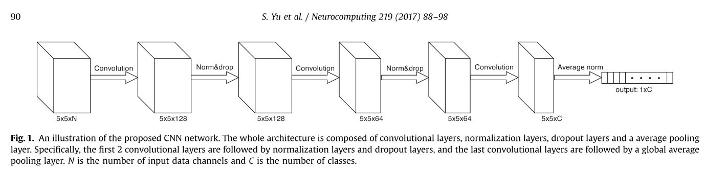

# CNN-HSI
## Introduction
This is a reproduction of *Convolutional neural networks for hyperspectral image classification*.

## Requirements
* pytorch 1.3
* scikit-learn
* scipy
* visdom
## Experiment
模型分别在PaviaU，Salinas和KSC这三个基准数据集上进行测试。实验总共分为三组，分别为每类样本量为10，每类样本量为50和每类样本量为100.为了减少误差，每组实验分别进行10次，最终的准确率取10次实验的均值。

在PaviaU数据集上的准确率（%）如下表所示：
<table>
<tr align="center">
<td colspan="6">PaviaU</td>
</tr>
<tr align="center">
<td colspan="2">10</td>
<td colspan="2">50</td>
<td colspan="2">100</td>
</tr>
<tr align="center">
<td>mean</td>
<td>std</td>
<td>mean</td>
<td>std</td>
<td>mean</td>
<td>std</td>
</tr>
<tr align="center">
<td>82.13</td>
<td>2.52</td>
<td>95.21</td>
<td>0.81</td>
<td>97.35</td>
<td>0.35</td>
</tr>
</table>

在Salinas上的准确率（%）如下表所示：
<table>
<tr align="center">
<td colspan="6">Salinas</td>
</tr>
<tr align="center">
<td colspan="2">10</td>
<td colspan="2">50</td>
<td colspan="2">100</td>
</tr>
<tr align="center">
<td>mean</td>
<td>std</td>
<td>mean</td>
<td>std</td>
<td>mean</td>
<td>std</td>
</tr>
<tr align="center">
<td>91.31</td>
<td>1.13</td>
<td>95.08</td>
<td>0.38</td>
<td>96.28</td>
<td>0.42</td>
</tr>
</table>

在KSC数据集上的准确率（%）如下表所示：
<table>
<tr align="center">
<td colspan="6">KSC</td>
</tr>
<tr align="center">
<td colspan="2">10</td>
<td colspan="2">50</td>
<td colspan="2">100</td>
</tr>
<tr align="center">
<td>mean</td>
<td>std</td>
<td>mean</td>
<td>std</td>
<td>mean</td>
<td>std</td>
</tr>
<tr align="center">
<td>91.13</td>
<td>1.60</td>
<td>97.39</td>
<td>0.95</td>
<td>98.05</td>
<td>0.37</td>
</tr>
</table>

## Runing the code
训练CNN_HSI `python CrossTrain.py --name xx --epoch xx --lr xx`
